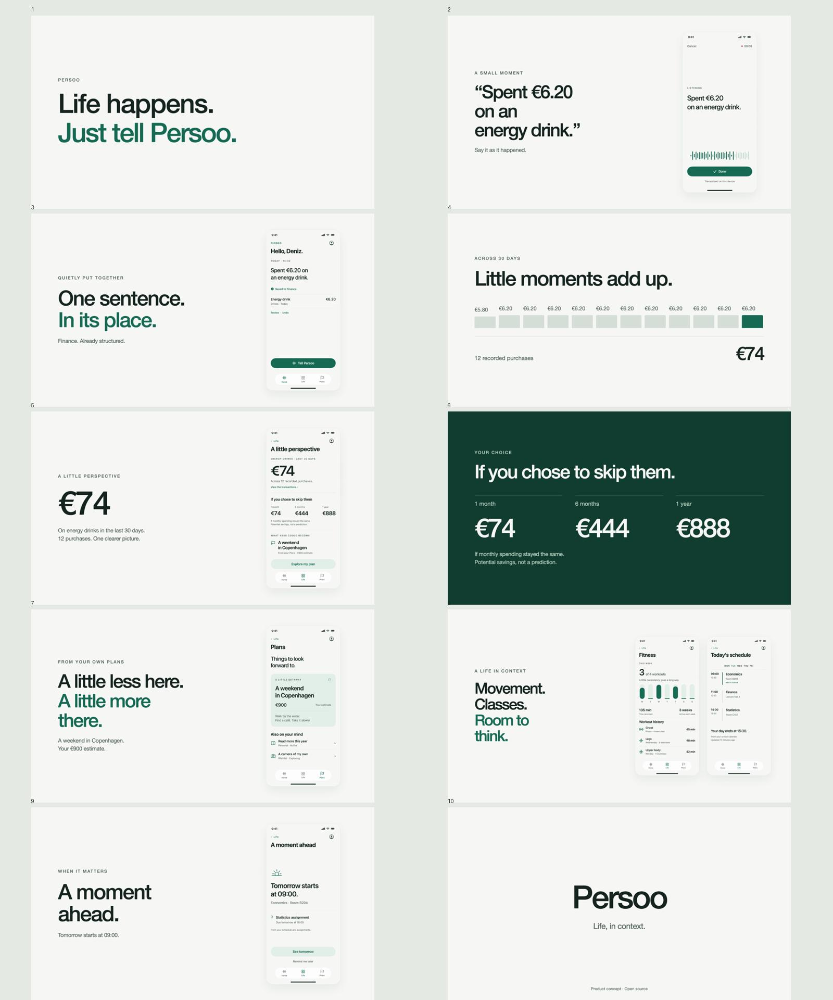

# Persoo

**Don't organize your life. Just tell Persoo what happened.**

An open-source, iPhone-first personal intelligence harness. Conversation becomes structured, inspectable personal state across School, Finance, Health, Personal, To-do and Plans.

## Watch

[Launch film — 54 seconds, 1080p / 60fps](film/deliverables/Persoo-Launch-Film-60fps.mp4) · [Portrait preview concept — 24 seconds / 30fps](film/deliverables/Persoo-App-Preview-Concept-30fps.mp4)

## Project status

Product foundation, local SwiftUI design prototype and two rendered concept films are available. The design includes 19 screens, reusable views, and 30 image exports covering selected compact, dark and Turkish states. Film visuals come directly from that design, with original synthesized sound and editable Remotion compositions.

This is a design-stage project. Inference, speech recognition, persistence, notifications and integrations are specified, not implemented. Both films use synthetic data. The portrait export matches the checked technical preview profile; it is not submission-ready App Store footage. It must be replaced with recordings of the working iOS application before submission.

The intended client is native SwiftUI with local authoritative structured state, a user-configured OpenAI-compatible endpoint and proposed local Whisper transcription. Models propose validated changes. A versioned protocol leaves room for Android and other clients.

## Explore and reproduce

- [Local design source and instructions](design/LOCAL-DESIGN.md)
- [Native screen overview](qa/local-ui-overview.jpg)
- [Film production and render instructions](film/README.md)
- [Creative direction and storyboard](film/storyboard.md)
- [Visual and encoding QA](qa/local-production.md)
- [Product specification](docs/product.md)
- [Architecture proposal](docs/architecture.md)
- [Design foundations](docs/design.md)
- [Privacy requirements](docs/privacy.md)
- [AI and state model](docs/ai-state-model.md)
- [Video research and delivery constraints](docs/video.md)

Figma work was superseded by the user-authorized local workflow. The earlier [Figma file](https://www.figma.com/design/oZ7fizliNxlUAKFrqxsqLw) is partial and is not the design source of truth.

## Contributing and license

See [CONTRIBUTING.md](CONTRIBUTING.md). Never commit personal records or credentials. Original source, design and synthesized sound are MIT. Third-party tooling, Apple resources, system fonts and SF Symbols retain their own licenses. No font binaries or third-party music are distributed. Persoo is independent of Apple and OpenAI.
